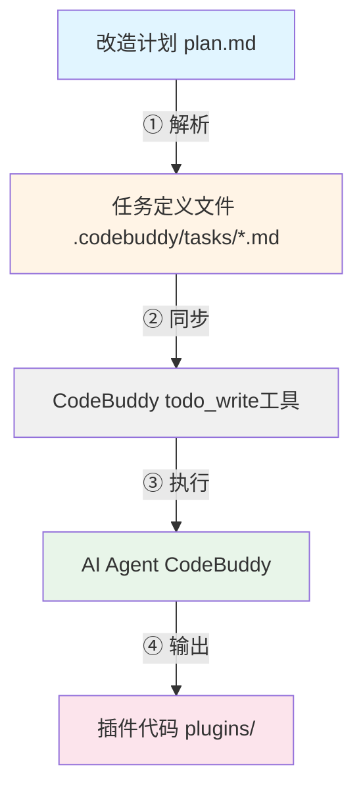

## 产品概述

Skills架构改造的改造前准备工作，为从单文件架构（24k行）到插件化架构的改造奠定基础。基于《Skills架构改造-整合指导框架.md》文档，完成7项关键准备工作，并集成**自动化任务管理方案**以解决任务管理混乱问题，确保改造过程可控、可回退、风险可控。

**核心创新**：采用 **Markdown + YAML front matter** 定义任务，通过 **CodeBuddy AI Agent** 自动解析并生成结构化任务列表，利用 `todo_write` 工具实现任务流转与状态追踪，无需引入spec-kit等外部工具。

## 核心功能

### 1. 核心模块文件确认

- 验证4个核心模块文件（plugin-base.js、plugin-loader.js、dual-adapter.js、event-hub.js）已创建且语法正确
- 确认文件大小 > 0，无语法错误

### 2. 目录结构创建

- 创建插件目录结构（plugins/core/、plugins/optional/）
- 确保目录结构符合架构设计

### 3. 技术栈环境确认

- 验证开发环境符合ES6+要求
- 检查代码中是否使用禁止的语法（var、require、.ts文件、IE11兼容代码）
- 确认浏览器支持范围（Chrome 60+、Firefox 55+、Safari 11+）

### 4. 现有代码分析

- 统计admin-legacy.html的代码规模（约24,000行）
- 识别可插件化的功能模块（auth、ai、scale、scoring、npc、meditation、analytics）
- 分析全局变量和插件间依赖关系

### 5. 双端适配准备

- 识别H5端和小程序端的API差异
- 验证DualAdapter是否已实现所有需要的适配接口
- 确保禁止在H5端直接使用小程序专有API

### 6. 测试环境准备

- 准备浏览器测试环境（Chrome、Firefox、Safari）
- 准备小程序测试环境（微信开发者工具）
- 准备手动测试用例（PluginLoader、EventHub、Adapter）

### 7. 回退方案准备

- 备份现有代码（backup/before-refactoring/）
- 设计渐进式改造方案（改造一个启用一个）
- 设计单个插件改造失败的回退机制

### 8. 自动化任务管理（新增）

- 创建任务定义文件（`.codebuddy/tasks/skills-architecture-tasks.md`）
- 实现从改造计划自动解析生成任务列表
- 使用 `todo_write` 工具实现任务流转与状态追踪
- 设计任务状态持久化机制（Markdown + YAML front matter）
- 实现自动化任务流转（完成任务后自动开始下一个）

## Tech Stack Selection

**当前技术栈**：

- 语言：ES6+ (ES2017+)
- 构建工具：无（使用`<script>`标签引入 + 动态`import()`）
- 代码规范：ESLint + Prettier（可选）
- 测试框架：Jest + Playwright（可选）
- 浏览器支持：Chrome 60+, Firefox 55+, Safari 11+ (无需IE11)
- 规则文件格式：Markdown (.md)
- 规则加载机制：CodeBuddy AI Agent 自动加载 `.codebuddy/rules/` 目录下的所有规则文件
- 字符限制：单个规则文件 ≤ 10,000 字符

**验证工具**：

- Node.js（用于JavaScript语法检查：`node --check`）
- Unix命令行工具（ls、grep、find、tree、wc）
- 浏览器开发者工具（Console）
- 微信开发者工具

**自动化任务管理技术栈**：

- 任务定义格式：Markdown + YAML front matter
- 任务解析：CodeBuddy AI Agent（文件读取 + 正则解析）
- 任务状态管理：CodeBuddy `todo_write` 工具
- 状态持久化：文件系统（`.codebuddy/tasks/*.md`）

## Implementation Approach

### 核心策略：分阶段准备，降低改造风险

**准备工作的逻辑顺序**：

1. **基础设施验证**（任务1-3）：确认核心模块文件、目录结构、技术栈环境
2. **代码分析**（任务4-5）：分析现有代码规模、模块划分、双端API差异
3. **环境与风险控制**（任务6-7）：准备测试环境、制定回退方案
4. **自动化任务管理**（任务8-11）：创建任务定义、实现自动解析、集成到工作流

**关键决策**：

1. **为什么先验证核心模块文件？**

- 核心模块是插件架构的基础，必须首先确认其存在和正确性
- 如果核心模块文件缺失或语法错误，后续改造无法进行

2. **为什么采用渐进式改造？**

- 改造过程中现有功能必须保持可用（文档第9节Q1）
- 改造一个插件，就启用一个插件，没改造的模块继续保持原样
- 降低改造风险，避免"大爆炸"式改造

3. **为什么需要回退方案？**

- 改造失败时能够快速回退（文档第9节Q2）
- 单个插件改造失败时，只需注释掉`export default`并恢复原来的`<script>`引入方式

4. **为什么需要自动化任务管理？**

- 解决任务管理混乱问题（用户反馈）
- 提供结构化任务列表，明确依赖关系
- 实现任务状态自动流转，减少人工干预
- 与现有CodeBuddy工作流无缝集成

### 自动化任务管理实现方案

**任务定义格式设计**：

文件位置：`.codebuddy/tasks/skills-architecture-tasks.md`

```markdown
---
title: Skills架构改造任务列表
version: 1.0.0
created: 2026-05-29
updated: 2026-05-29
status: in_progress
---

# 📋 Skills架构改造 - 自动化任务列表

## 任务概览

| 任务ID | 任务内容                          | 状态    | 依赖 | 预计时间 | 负责人   |
| ------ | --------------------------------- | ------- | ---- | -------- | -------- |
| T001   | 验证4个核心模块文件存在且语法正确 | pending | -    | 0.5天    | AI Agent |
| T002   | 创建插件目录结构                  | pending | -    | 0.5天    | AI Agent |
| ...    | ...                               | ...     | ...  | ...      | ...      |

## 任务详情

### T001: 验证4个核心模块文件存在且语法正确

**状态**: pending  
**依赖**: 无  
**预计时间**: 0.5天  
**验收标准**:

1. `plugin-base.js` 文件存在且语法正确
2. `plugin-loader.js` 文件存在且语法正确
3. `dual-adapter.js` 文件存在且语法正确
4. `event-hub.js` 文件存在且语法正确

**执行步骤**:

1. 使用 `ls -lh` 检查文件是否存在
2. 使用 `node --check` 验证JavaScript语法
3. 输出验证报告
```

**自动解析与生成机制**：

目标：从改造计划（`plan.md`）自动生成任务列表

实现逻辑：

1. 读取改造计划文件
2. 解析出todolist部分
3. 生成任务定义文件
4. 同步到CodeBuddy的todo_write工具

触发条件：

- **改造计划更新**：用户修改 `plan.md` 时重新解析
- **手动触发**：用户输入 "重新生成任务列表"
- **定时检查**：每天定时检查 `plan.md` 是否更新

**任务流转与状态追踪机制**：

状态流转图：

```
                    ┌─────────────┐
                    │   pending   │
                    └──────┬──────┘
                           │ 开始执行
                           ▼
                    ┌─────────────┐
                    │in_progress │◄──────────────────┐
                    └──────┬──────┘                   │
                           │ 执行完成                   │ 执行失败
                           ▼                            │
                    ┌─────────────┐              ┌─────┴─────┐
                    │ completed  │              │  retry?    │
                    └─────────────┘              └─────┬─────┘
                                                        │
                                                        ▼
                                                  ┌─────────────┐
                                                  │in_progress │
                                                  └─────────────┘
```

状态追踪实现方式：

方式1：使用CodeBuddy的`todo_write`工具（主要方式）

```javascript
// 开始执行任务T001
await todo_write({
  merge: true, // 使用merge模式，只更新特定任务
  todos: JSON.stringify([
    {
      id: 'verify-core-modules',
      status: 'in_progress',
      content: '验证4个核心模块文件存在且语法正确'
    }
  ])
});

// 任务T001执行完成
await todo_write({
  merge: true,
  todos: JSON.stringify([
    {
      id: 'verify-core-modules',
      status: 'completed',
      content: '验证4个核心模块文件存在且语法正确'
    }
  ])
});
```

方式2：更新任务定义文件（辅助方式，用于持久化）

```javascript
// 读取任务定义文件
let tasksContent = await read_file('.codebuddy/tasks/skills-architecture-tasks.md');

// 更新任务T001的状态
tasksContent = tasksContent.replace(
  '**状态**: pending', // 旧状态
  '**状态**: completed ✅' // 新状态
);

// 写回文件
await write_to_file('.codebuddy/tasks/skills-architecture-tasks.md', tasksContent);
```

**与现有项目架构的集成方式**：

集成点分析：

| 集成点        | 集成方式                   | 说明                       |
| ------------- | -------------------------- | -------------------------- |
| **改造计划**  | 解析 `plan.md`             | 从改造计划自动生成任务列表 |
| **CodeBuddy** | 使用 `todo_write` 工具     | 管理任务状态，支持流式更新 |
| **规则文件**  | 遵循8个规则文件            | 任务执行时需符合架构规范   |
| **插件架构**  | 任务输出到 `plugins/` 目录 | 生成的插件代码放到正确位置 |

集成架构图：



## Implementation Notes

### 性能优化

- **核心模块验证**：使用`node --check`快速验证语法，无需执行代码
- **代码规模统计**：使用`wc -l`快速统计行数，使用`grep -c`统计script标签数量
- **技术栈验证**：使用`grep -r`快速识别禁止的语法（var、require、.ts文件）
- **任务解析**：使用正则表达式解析Markdown，无需额外依赖

### 日志记录

- 在备份目录创建`BACKUP_INFO.md`，记录备份时间、文件列表、回退步骤
- 在测试环境准备完成后，输出测试环境信息（浏览器版本、小程序工具版本）
- 在任务定义文件中记录任务执行日志（开始时间、完成时间、执行结果）

### blast半径控制

- **渐进式改造**：改造一个插件，就启用一个插件，避免一次性改造所有模块
- **回退方案**：每个插件独立，改造失败只需回退单个插件，不影响其他模块
- **禁止修改核心基类**：plugin-base.js、plugin-loader.js、dual-adapter.js、event-hub.js属于核心基础设施，禁止修改其接口和核心逻辑
- **任务管理隔离**：自动化任务管理方案独立于插件架构，不影响现有功能

## 设计风格

本方案主要涉及后端架构改造和任务管理自动化，不涉及前端UI设计。但任务定义文件的展示可以采用简洁清晰的Markdown格式，便于人工阅读和机器解析。

## 任务定义文件设计

任务定义文件（`.codebuddy/tasks/skills-architecture-tasks.md`）采用以下设计原则：

1. **简洁性**：使用Markdown表格展示任务概览，清晰明了
2. **结构化**：每个任务有独立的详情章节，包含状态、依赖、验收标准、执行步骤
3. **可解析性**：使用YAML front matter存储元数据，便于机器解析
4. **可读性**：使用emoji和代码块增强可读性

## 示例

```markdown
---
title: Skills架构改造任务列表
version: 1.0.0
created: 2026-05-29
updated: 2026-05-29
status: in_progress
---

# 📋 Skills架构改造 - 自动化任务列表

## 任务概览

| 任务ID | 任务内容            | 状态         | 依赖 | 预计时间 | 负责人   |
| ------ | ------------------- | ------------ | ---- | -------- | -------- |
| T001   | 验证4个核心模块文件 | ✅ completed | -    | 0.5天    | AI Agent |

## 任务详情

### T001: 验证4个核心模块文件

**状态**: ✅ completed  
**依赖**: 无  
**预计时间**: 0.5天  
**验收标准**: ...
```
